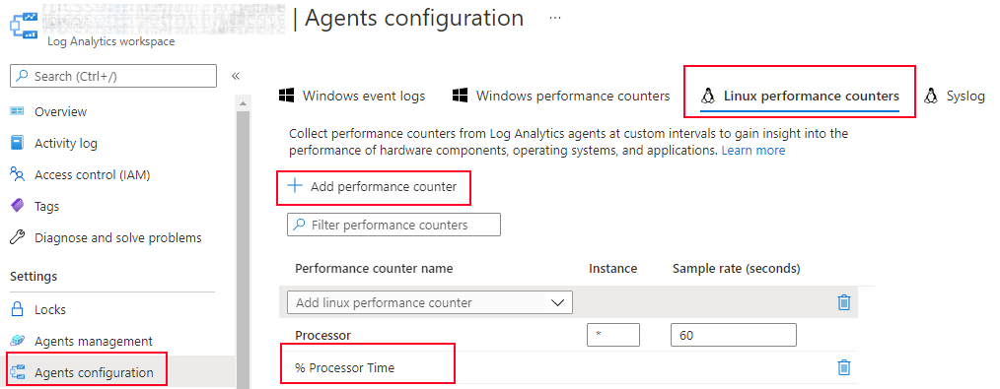
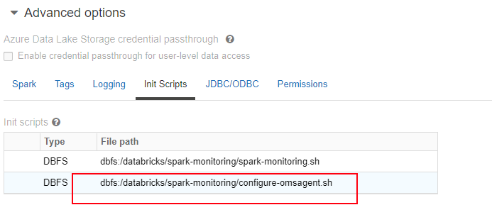
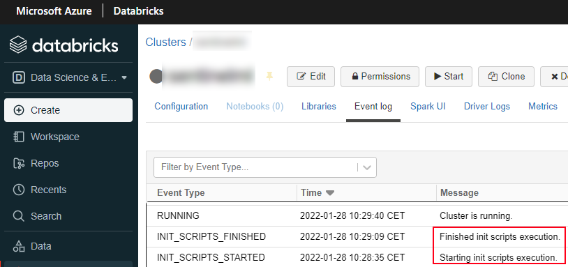
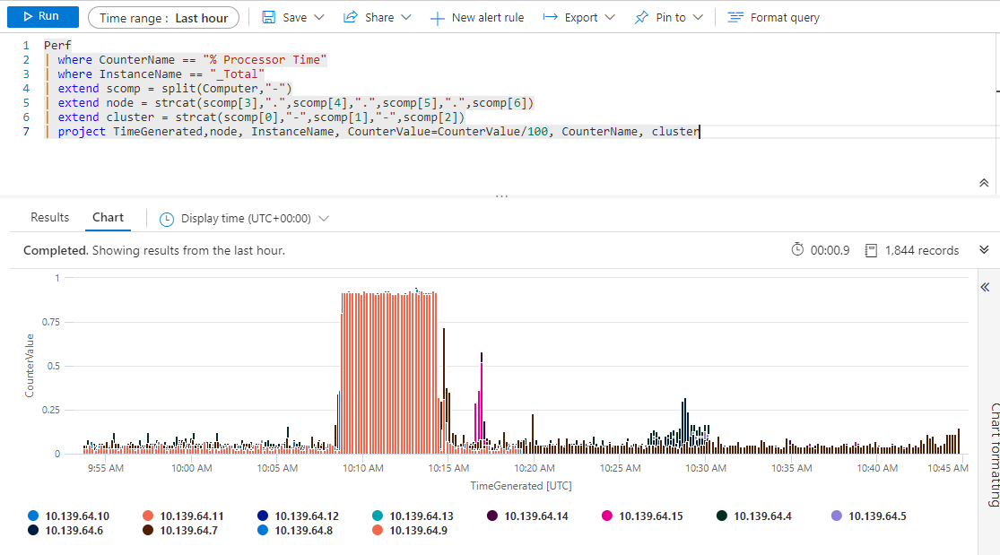

<div>
    <a href="https://github.com/sponsors/enriquecatala"></a>
    <a href="https://enriquecatala.com"></a>
    <a href="https://www.linkedin.com/in/enriquecatala"></a>
    <a href="https://twitter.com/enriquecatala"></a>
    <a href="https://youtube.com/enriquecatala"></a>
</div>

<a href="https://mvp.microsoft.com/es-es/PublicProfile/5000312?fullName=Enrique%20Catala"></a>

# OMS-Agent-for-Databricks

This project contains a script to deploy [OMS Agent for linux](
https://github.com/microsoft/OMS-Agent-for-Linux) in a Databricks cluster.

>NOTE: For more information please visit [here](https://docs.microsoft.com/en-us/azure/virtual-machines/extensions/oms-linux?toc=%2Fazure%2Fazure-monitor%2Ftoc.json)


# Deploy OMS Agent in a Databricks cluster
## 1) Activate performance counters

To be able to store performance counters in Log Analytics, you need first to manually activate/enable the performance counters you want to collect:



>NOTE: For more info click [here](https://docs.microsoft.com/en-us/azure/azure-monitor/agents/data-sources-performance-counters)

## 2) Install OMS Agent in databricks
### Deploy omsagent service

To deploy the OMS Agent, you need to upload to your cluster the [configure-omsagent.sh](configure-omsagent.sh) script.

There are other ways to deploy the script into your cluster, but this is may be the easiest way:

```bash
dbfs --profile YOUR_PROFILE_ cp --overwrite ./configure-omsagent.sh dbfs:/databricks/spark-monitoring/
```

>NOTE: Last command required to have installed and configured [databricls cli](https://docs.databricks.com/dev-tools/cli/index.html)

### Include the init script

Time to include the init script into your cluster:
> dbfs:/databricks/spark-monitoring/configure-omsagent.sh




## 3) Start your cluster

After starting your cluster, please check that the init scripts executed successfully (no error found)



# Query the data

You can query it by using Kusto Query Language (KQL) from the Azure Log Analytics portal or your favorite language programming.

```kql
Perf
| where CounterName == "% Processor Time"
| where InstanceName == "_Total"
| extend scomp = split(Computer,"-")
| extend node = strcat(scomp[3],".",scomp[4],".",scomp[5],".",scomp[6])
| extend cluster = strcat(scomp[0],"-",scomp[1],"-",scomp[2])
| project TimeGenerated,node, InstanceName, CounterValue=CounterValue/100, CounterName, cluster
```

>NOTE: For more info, please read about [KQL](https://docs.microsoft.com/en-us/azure/data-explorer/kusto/query/)




# Troubleshooting and verification steps

If no data is shown at the Azure Log Analytics Portal, there are some possible reasons to check. 

>NOTE: For more info, please check the official [troubleshooting guide](https://docs.microsoft.com/en-us/azure/azure-monitor/agents/agent-linux-troubleshoot)


Please execute the following cells from a databricks notebook:

## 1) Check that OMS Agent is installed

```bash
%sh
dpkg --list omsconfig
```
## 2) Check the status of the configuration

```bash
%sh
sudo su omsagent -c 'python /opt/microsoft/omsconfig/Scripts/GetDscConfiguration.py'
```

You should get messages saying that the configuration is running 

```bash
Opened the dsc host lock file at the path '/opt/dsc/dsc_host_lock'
b'socketpair - succeeded
fork - succeeded: this is the parent
fork - succeeded: this is the child
In PythonProvider.
send succeeded
Found python2.
Found python2.
Script path: 
/opt/microsoft/omsconfig/Scripts/client.py
1
In PythonProvider, using:
python2
recv\'d POSITIVE
value added - name: "Group" - type: 13
value added - name: "Links" - type: 13
value added - name: "MaxOutputSize" - type: 7
value added - name: "UseSudo" - type: 0
value added - name: "CreatedDate" - type: 12
value added - name: "Recurse" - type: 0
value added - name: "MaxContentsReturnable" - type: 5
value added - name: "DestinationPath" - type: 13
value added - name: "ModifiedDate" - type: 12
value added - name: "Checksum" - type: 13
value added - name: "Owner" - type: 13
value added - name: "FileSize" - type: 7
value added - name: "Type" - type: 13
value added - name: "Contents" - type: 13
value added - name: "Mode" - type: 13
packing succeeded!
socketpair - succeeded
...
```

If last command fails, please check that configuration is working fine

```bash
%sh
sudo su omsagent -c 'python /opt/microsoft/omsconfig/Scripts/PerformRequiredConfigurationChecks.py'
```

Again, you should expect positive messages or errors. Please read them to fix (if any)

```bash
Opened the dsc host lock file at the path '/opt/dsc/dsc_host_lock'
[2022/01/27 09:56:12] [8132] [INFO] [0] [/opt/microsoft/omsconfig/Scripts/PerformRequiredConfigurationChecks.py:0] dsc_host lock file is acquired by : PerformRequiredConfigurationChecks

b"socketpair - succeeded
fork - succeeded: this is the parent
fork - succeeded: this is the child
In PythonProvider.
send succeeded
Found python2.
Found python2.
Script path: 
/opt/microsoft/omsconfig/Scripts/client.py
1
In PythonProvider, using:
python2
recv'd POSITIVE
recv succeeded
socketpair - succeeded
fork - succeeded: this is the parent
fork - succeeded: this is the child
In PythonProvider.
send succeeded
Found python2.
Found python2.
Script path: 
/opt/microsoft/omsconfig/Scripts/client.py
1
In PythonProvider, using:
python2
recv'd POSITIVE
recv succeeded
socketpair - succeeded
...
```


### Check configuration file

If something is not working and you think it´s because of a misconfiguration, please check if the omsagent.conf automatically configured is having some issue. You can check the value of the configuration file by executing the following command in a databricks notebook:

```bash
%sh
ls /etc/opt/microsoft/omsagent/[REDACTED]/conf -ls
cat /etc/opt/microsoft/omsagent/[REDACTED]/conf/omsagent.conf
```

>NOTE: Please change _[REDACTED]_ by the value of your LOG_ANALYTICS_WORKSPACE_ID